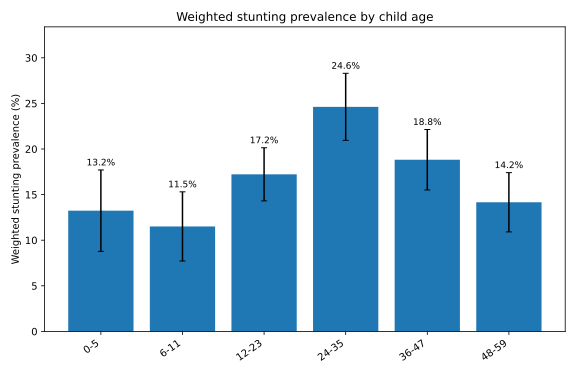
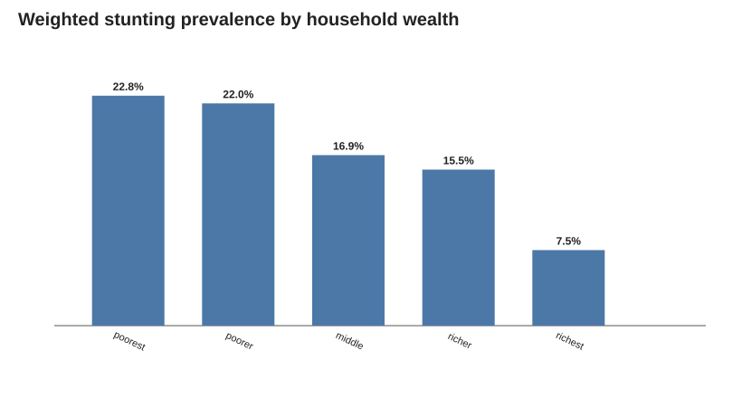
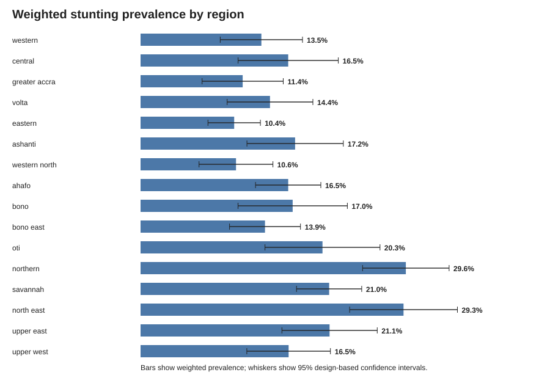
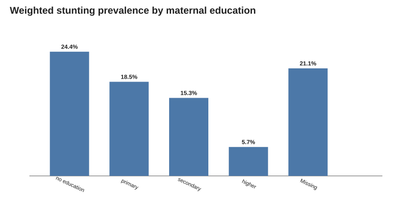
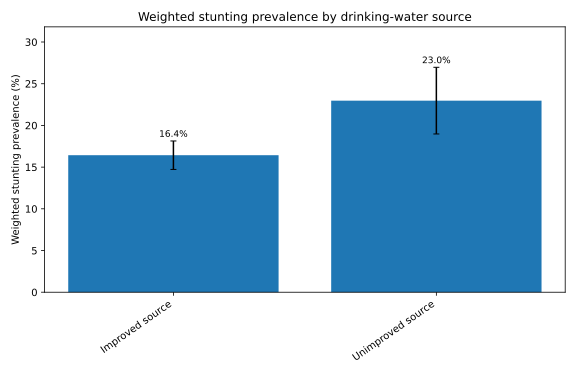
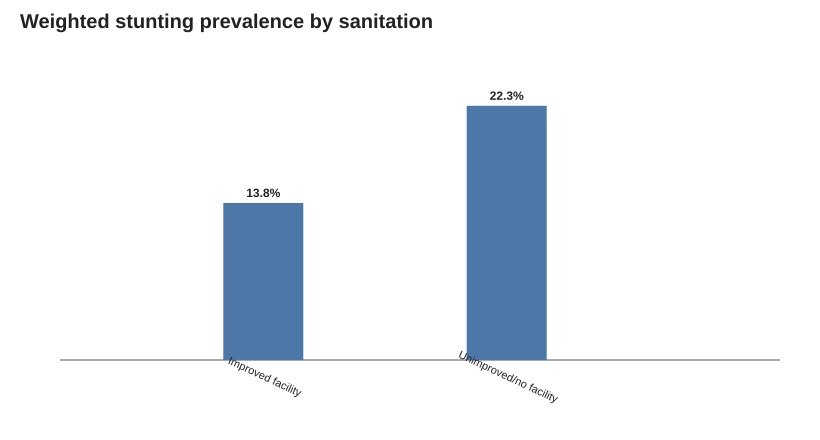

# Bayesian Hierarchical Modelling of Childhood Stunting in Ghana

This repository contains the reproducible analysis, thesis materials, and manuscript workflow for a publication-oriented thesis on childhood stunting in Ghana using the 2022 Ghana Demographic and Health Survey (GDHS).

## Research aim

The project investigates individual-, household-, and community-level factors associated with childhood stunting in Ghana using Bayesian hierarchical logistic regression.

## Planned modelling sequence

1. Baseline community-level hierarchical model.
2. Household + community random-intercept model.
3. Extension with water and sanitation variables.
4. Extension with maternal education.
5. Survey-weight sensitivity analysis.
6. Prior sensitivity analysis.
7. Posterior predictive checks and model comparison.
8. Publication-ready tables, figures, and manuscript outputs.

## Data access and confidentiality

Raw DHS datasets are **not stored in this repository**. Users must obtain the 2022 Ghana DHS data directly from The DHS Program under its data-use conditions.

The analysis code expects locally stored DHS recode files and produces only derived, non-identifying research outputs suitable for reproducible academic work.

## Project status

Ongoing thesis research intended for publication and PhD application support.

## Current validated descriptive results

The current analytic sample contains **4,928 children**, **927 stunted children**, **3,545 households**, and **616 communities**. The survey-weighted stunting prevalence is **17.39%**.

All figures below are generated from aggregate, non-identifying outputs committed under `results/tables/`. They can be regenerated from authorized DHS microdata with `src/02_descriptive_analysis.py`.

### Age pattern

### Household wealth gradient

### Regional pattern

### Maternal education

### WASH indicators

Additional figures for sex and residence are available in `results/figures/`.

## Reproducible public outputs

- `results/tables/descriptive_all.csv` — exact aggregate data behind the descriptive figures.
- `results/tables/analysis_sample_summary.csv` — analytic sample and clustering counts.
- `results/tables/household_structure.csv` — distribution of eligible children per household.
- `results/figures/` — publication-ready SVG figures.
- `docs/variable_dictionary.md` — mapping of thesis constructs to DHS source variables.

Raw DHS microdata and row-level derived extracts are deliberately excluded from the repository. Researchers must obtain the 2022 Ghana DHS files directly from The DHS Program under its access conditions.

## Current Bayesian findings

The current three-level analyses model children within households and households within survey communities.

Key findings from the present posterior runs include:

- **Household heterogeneity is substantially larger than community heterogeneity.** In Model 1, the posterior median household SD was 1.07 compared with a community SD of 0.42. The household VPC was approximately 0.25 and the community ICC approximately 0.04.
- **Unimproved drinking-water source** remained associated with higher posterior odds of stunting after adjustment. In Model 3, the posterior median OR was 1.50 (95% posterior interval 1.15–1.99).
- **Sanitation facility type** showed a weaker and more uncertain adjusted association in Model 3: OR 1.12 (0.86–1.46).
- **Higher maternal education** was associated with substantially lower posterior odds of stunting relative to no formal education: OR 0.37 (0.20–0.65).
- The **wealth gradient attenuated but persisted** after maternal education was added; richest versus poorest had OR 0.36 (0.20–0.63) in Model 3.
- Posterior predictive checks reproduced the overall and age-specific stunting patterns reasonably well.
- Harmonized Model 2 and Model 3 had very similar predictive performance under PSIS-LOO; Model 3 improved ELPD by only about 0.92 (SE 3.38), with no Model 3 observations above Pareto k = 0.70.

An extended 8-chain Model 3 run produced 4,000 retained posterior draws, zero divergences, BFMI between 0.51 and 0.66, and no tree-depth saturation. Fixed effects showed excellent convergence; the two hierarchical SDs remain the slowest-mixing quantities, with R-hat approximately 1.02.

See `results/tables/`, `results/figures/`, and `thesis/chapter4_results.tex` for the current aggregate outputs.
