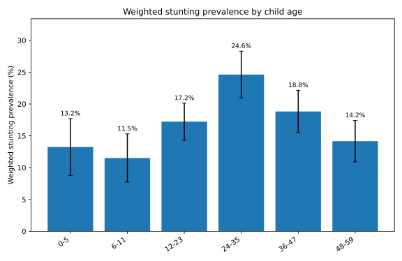
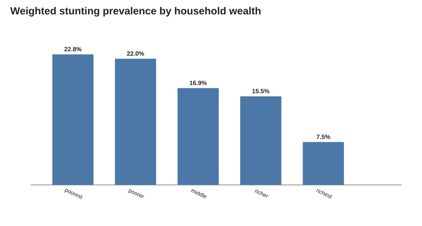
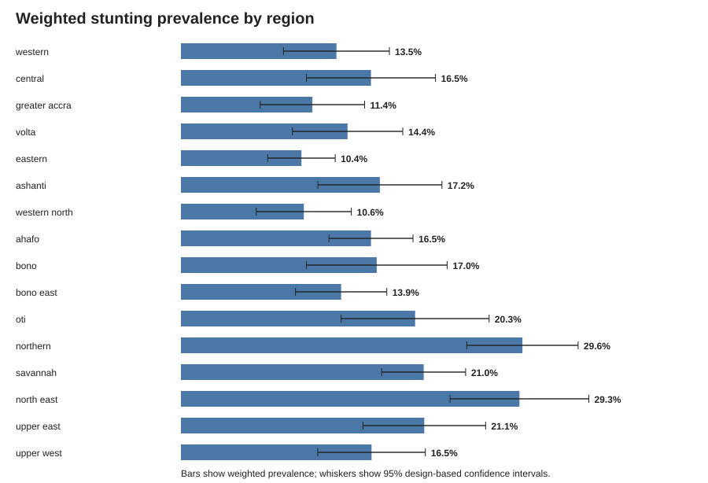
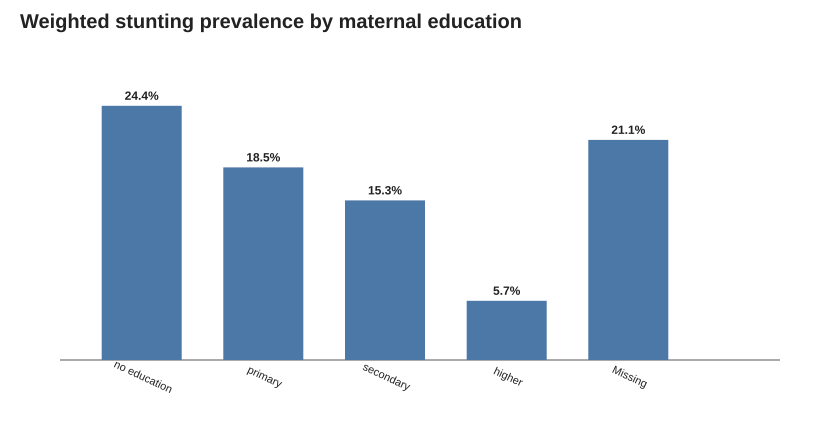
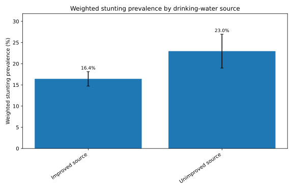
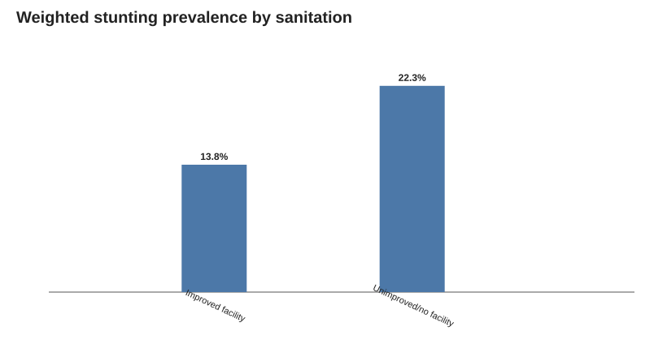

# Bayesian Hierarchical Modelling of Childhood Stunting in Ghana

**Author:** Gideon Ofosu Kyere  
**Affiliation:** Kwame Nkrumah University of Science and Technology, Kumasi-Ghana  
**ORCID:** 0009-0003-9848-8437

This project uses the **2022 Ghana Demographic and Health Survey (GDHS)** to study childhood stunting through a three-level Bayesian model.

The question that drove the work was simple: **after accounting for measured characteristics, how much of the remaining variation in stunting is shared within households, and how much is shared across communities?**

That question led to a model with children nested within households and households nested within survey communities. I later extended the analysis to examine water and sanitation, maternal education, survey weighting, alternative age specifications, and prior sensitivity.

## Data

The analysis uses the 2022 Ghana DHS Household Member Recode.

The core sample contains 4,928 children aged 0–59 months with valid height-for-age measurements:

- 927 stunted children
- 3,545 households
- 616 survey communities

The survey-weighted prevalence of stunting is 17.39%, matching the published 2022 GDHS estimate.

Raw DHS files are restricted and are not included in this repository. They must be requested directly from [The DHS Program](https://dhsprogram.com/). Only code, aggregate tables, figures, and other non-identifying outputs are stored here.

## Main findings

The clearest result is the contrast between household and community heterogeneity.

Once both levels are included, the household random effect is much larger than the community random effect. In the strengthened final model, the posterior median household SD is about 1.23, compared with 0.39 at the community level. That corresponds to a household VPC of about 0.31 and a community ICC of about 0.03.

The household median odds ratio is about 3.24, versus 1.45 for communities. In practical terms, the remaining clustering in childhood stunting is much stronger within households than between survey communities.

Several fixed-effect estimates were also stable across model specifications:

- boys had higher posterior odds of stunting than girls: OR 1.50 (95% posterior interval 1.24–1.82);
- children aged 24–35 months had higher odds than children aged 0–5 months: OR 2.91 (2.06–4.21);
- children in the richest households had lower odds than those in the poorest: OR 0.36 (0.20–0.64);
- unimproved drinking-water source had OR 1.50 (1.15–1.99);
- higher maternal education had OR 0.37 (0.20–0.65).

The sanitation estimate was weaker after adjustment: OR 1.12 (0.86–1.46).

A more detailed WASH sensitivity analysis suggested that the water association was clearest for surface-water use. The estimate also became less precise under the survey-weighted pseudo-posterior, so I treat the water result more cautiously than the age, sex, wealth, and maternal-education findings.

## Model checks

The final Model 3 diagnostic run combines eight independent chains and 4,000 retained posterior draws.

There were no divergences, BFMI ranged from 0.51 to 0.66, and no chain reached the maximum tree depth. The fixed effects mixed well. Household and community standard deviations were slower to mix, with R-hat values around 1.02, so their exact intervals deserve a little more caution.

Posterior predictive checks reproduced both the observed overall stunting prevalence and the age pattern well.

I also checked whether the main conclusions changed when I:

- used tighter or wider priors;
- incorporated survey weights through a pseudo-posterior;
- retained children with missing maternal education;
- replaced age groups with a spline;
- used more detailed WASH categories.

The broad pattern remained similar. An independent GEE analysis also found much stronger residual dependence within households than within communities, with working correlations of about 0.154 and 0.024 respectively. These are used only as robustness diagnostics and should not be interpreted as Bayesian ICCs.

A separate local rerun is documented in `docs/local_reproduction_2026-09-24.md`. It reproduced the analytic sample and the main scientific pattern without replacing the stronger locked manuscript summaries.

## Figures

### Stunting by age



### Stunting by household wealth



### Regional pattern



### Maternal education



### Drinking-water source



### Sanitation



## Repository structure

```text
src/                 analysis and diagnostic scripts
results/tables/      aggregate model and descriptive results
results/figures/     figures used in the long-form report and manuscript
docs/                variable definitions, audits, and diagnostic notes
thesis/              LaTeX long-form report files
manuscript/          journal manuscript and supplementary material
```

Useful starting points:

- `src/02_descriptive_analysis.py` — survey-weighted descriptive analysis
- `src/04_household_community_model.py` — household + community model
- `src/05_wash_model.py` — WASH extension
- `src/06_maternal_education_model.py` — maternal-education extension
- `src/10_final_production_diagnostics.py` — MCMC diagnostics
- `results/tables/model3_final_8chain_key_or.csv` — key final-model odds ratios
- `results/tables/model3_final_8chain_variance_summary.csv` — household/community variance results

## Reproducing the analysis

After obtaining authorized GDHS access, place the required PR recode file at:

```text
data/raw/GHPR8CFL.DTA
```

Install the dependencies in `requirements.txt`, then run the analysis scripts in numerical order.

The environment used for the strengthened diagnostic work is documented in `docs/executed_environment_2026-09-23.md`. Because that environment needed a PyMC/ArviZ compatibility workaround, `requirements.txt` is the better starting point for a clean rerun.

## Long-form report and manuscript

The repository contains both a long-form research report and a shorter journal manuscript.

The manuscript centers on the part of the project I find most informative: separating household and community heterogeneity rather than presenting another list of factors associated with stunting.

The study is observational, so all odds ratios are interpreted as associations rather than causal effects.

## Citation

A `CITATION.cff` file is included so GitHub can generate citation metadata for the repository. When the preprint receives a DOI, the repository citation and README should be updated to point to that public record. After journal publication, the preferred citation should be updated again to the final article.

The analysis software under `src/` is released under the MIT License (`src/LICENSE`). That license does not apply to restricted DHS microdata, manuscript text, journal-template assets, or other materials outside `src/`.
